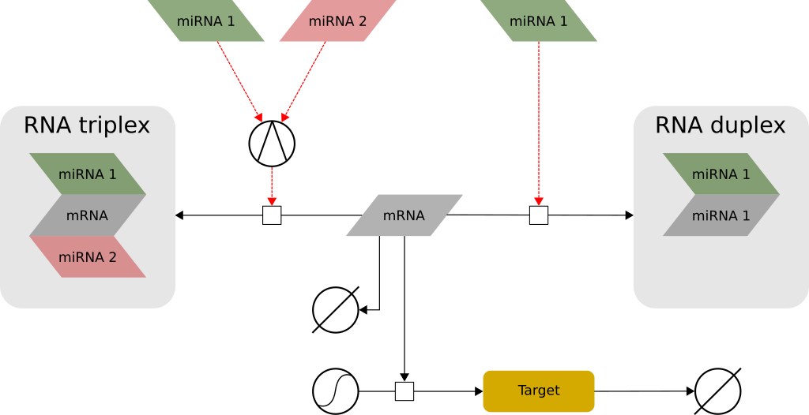
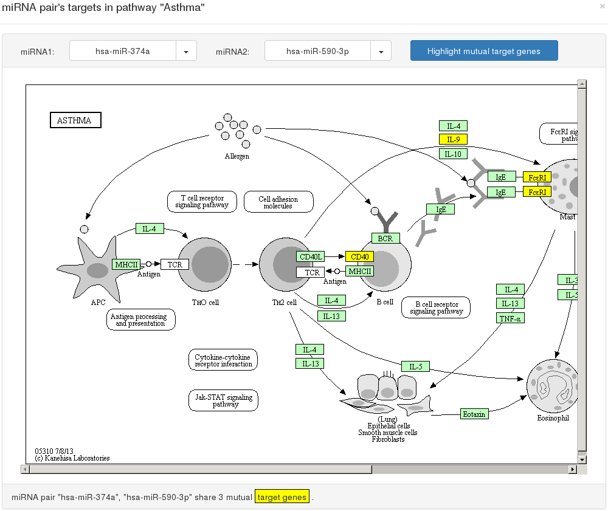

# TriplexRNA
A multi-organism database of cooperating microRNAs and their mutual targets

The triplexRNA contains predicted RNA *triplexes* composed of two cooperatively acting microRNAs (miRNAs) and their mutual target mRNA.

MiRNA cooperativity has been experimentally characterised by [Sætrom *et al.* (2007)](https://doi.org/10.1093/nar/gkm133]) as a strong regulatory pattern, whose formation inhibits the transcription of a target gene. This phenomenon is illustrated in **Figure 1**, and explained in detail by [Schmitz *et al.* (2014)](https://doi.org/10.1093/nar/gku465).

**Figure 1**. A target mRNA can be repressed by either a single miRNA (right), or by a pair of cooperating miRNAs (left). While in the first case miRNA and target form a *duplex* structure, the second case leads to the formation of a RNA *triplex*. In a RNA triplex, even if the expression of the cooperating miRNAs is only mildly up-regulated, an enhanced repressive effect can be observed as compared to the cases where single miRNAs are highly up-regulated.

## Data
The TriplexRNA contains predicted RNA triplexes for Human and Mouse. Each triplex is characterized by
- Statistics (Gibbs free energy, energy gain, seed distance, length)
- Dot-bracket notation assembly
- Graphical illustration of its simulated econdary structure
- Graphical illustration of its predicted equilibrium concentration

## Metabolic pathways
Since the presence of miRNAs can be correlated with the progression of known diseases, the TriplexRNA provides an interface for the navigation of known metabolic [KEGG](https://doi.org/10.1093/nar/28.1.27) pathways, within the framework of cooperative miRNA targets.

This feature is illustrated in **Figure 2**, and allows researchers to identify and test disease-specific miRNAs that could be used as diagnostic and prognostic biomarkers.

**Figure 2**. Visualization of the mutual target genes of selected miRNA pair hsa-miR-374a and hsa-miR-590-3p within the KEGG disease pathway *Asthma*. Here, common target genes are highlighted in yellow.
